<p align="center">
  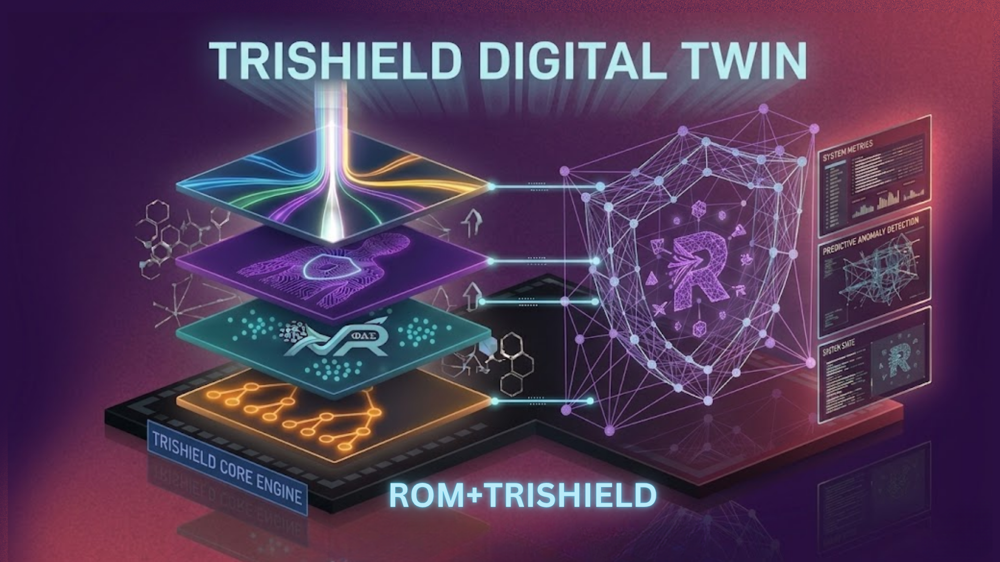
</p>

<h1 align="center">Tri-Shield Twin</h1>
<p align="center"><b>Physics-Informed Reliability Intelligence for Semiconductor Backend Assembly</b></p>

<p align="center">
  A dual-core predictive platform that fuses a <b>triple-layer ML ensemble</b> with a <b>Reduced Order Model (ROM) Digital Twin</b> to predict and prevent tolerance-stacking-driven packaging failures — before they propagate.
</p>

---

## Problem Statement

<p align="center">
  
</p>

Semiconductor packaging transforms a silicon die into a functional product through multiple assembly stages — die bonding, wire bonding, moulding, ball attachment, and singulation. Across this process, small parameter variations do not act independently but accumulate through **Tolerance Stacking**, where minor deviations at early stages compound with thermomechanical stresses in later stages.

This creates **"Walking Wounded"** units — structurally compromised packages that appear healthy at each individual checkpoint but are destined to fail at Final Test. Traditional Statistical Process Control (SPC) monitors parameters in isolation, completely missing these cross-stage interactions. By the time a defect is detected at late-stage testing, significant production resources have already been consumed.

> A **1% yield loss** in high-volume manufacturing translates to **millions in losses**. Late-stage defects cost up to **10x more** to resolve than early-stage intervention.

---

## Solution

We propose **Tri-Shield Twin**, a hybrid reliability intelligence platform built on a dual-core architecture:

### The Tri-Shield Sentinel (Real-Time Decisioning)

A triple-layer ML ensemble acts as a high-speed gatekeeper on the production line:

| Shield | Model | Role |
|--------|-------|------|
| **Shield 1** | LightGBM (Supervised) | Predicts known failure modes (Wire Sweep, Popcorn, Voiding) |
| **Shield 2** | Isolation Forest (Unsupervised) | Detects "Zero-Day" anomalies never seen before |
| **Shield 3** | Physics Rules Engine (7 Rules) | Enforces engineering constraints with **Deterministic Veto** authority |

### The ROM Digital Twin (Deep-Dive Investigation)

A physics-based **Reduced Order Model** reconstructs the internal stress state of flagged units:

- **50x50 von Mises Stress Field** via Proper Orthogonal Decomposition (POD)
- **Cumulative Reliability Index (CRI)** tracking across all 5 assembly stages
- **Physics-Based Root Cause Diagnosis** — identifies the exact parameter and stage driving stress
- **Sub-millisecond inference** (0.74–1.23 ms) suitable for edge deployment

---

## System Architecture

<p align="center">
  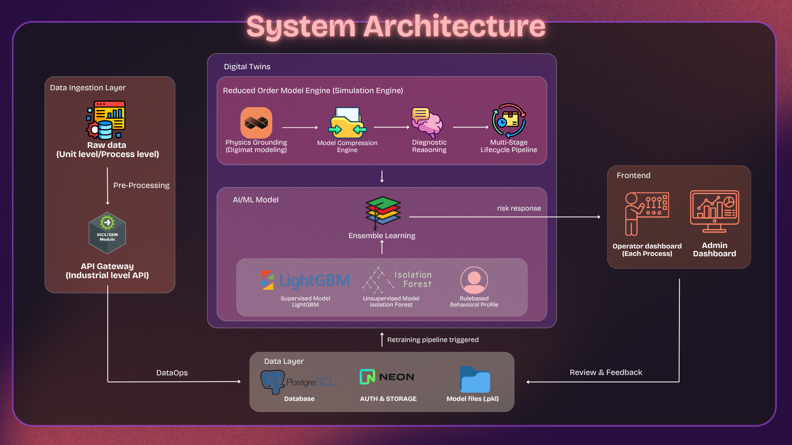
</p>

---

## Key Features

### 1. Yield Dashboard (Live Telemetry)
Real-time feed-forward telemetry across all 5 assembly stages (Die Bond to Singulation). Industrial color-coded risk indicators with live Cumulative IOL Failure Probability.

### 2. Unit Investigation (Machine Deep-Dive)
Searchable fleet directory of 93 machines with live risk status. 2D stress heatmaps reconstructed via ROM, with historical 24-hour risk trend mapping.

### 3. Tri-Layer Model Insights
Classification performance metrics (Precision, Recall, F1, FP Rate) with threshold-vs-metrics sweep. Shield Disagreement Table showing where LightGBM and Isolation Forest conflict — and why the Physics engine intervenes.

### 4. Physics Insights (Engineering Sandbox)
Interactive "What-If" simulation sandbox powered by the ROM Digital Twin. Engineers can adjust Molding Temperature, Vacuum Level, and Clamping Force to see predicted CRI outcomes in real-time.

### 5. Tuning Workspace (Process Control)
Centralized threshold configurator for Golden Baselines, Warning Limits, and Critical Limits with visual gradient indicators and full audit trail.

### 6. Unit Journey (Digital Birth Certificate)
End-to-end lifecycle traceability for individual units from Die Bond to Final Test, capturing every parameter, machine assignment, and risk score along the way.

---

## Technical Validation

<p align="center">
  
</p>

Validated on **200,000 synthetic units** generated via a physics-informed Multimodal Simulation Pipeline.

| Metric | Value |
|--------|-------|
| Shield 1 (LGB) AUC | **0.9402** |
| Ensemble AUC | **0.8837** |
| Ensemble Average Precision | **83.44%** |
| Peak F1-Score | **0.8925** (Threshold: 33.0) |
| Operational Threshold | **36.7** (conservative) |
| False Negative Source | Bin 4 — Fab Passthrough (physically undetectable) |
| ROM Stress Separation | **5.2x (287 MPa vs 55 MPa)** |
| ROM Inference Time | **< 1.3 ms** |
| POD Energy Captured | **>= 99%** with 5 modes |

### ML Ensemble Performance

<table width="100%">
  <tr>
    <td align="center" width="50%">
      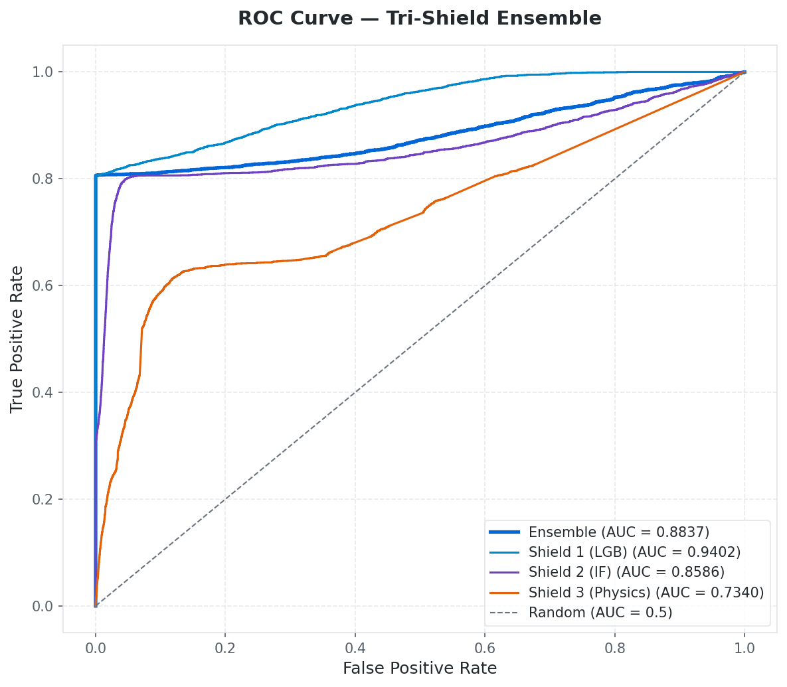<br/>
      <b>ROC-AUC Curve</b> — Shield 1 (LGB) achieves 0.94 AUC standalone. The Ensemble (0.88) deliberately trades raw AUC for broader per-bin coverage of rare defects.
    </td>
    <td align="center" width="50%">
      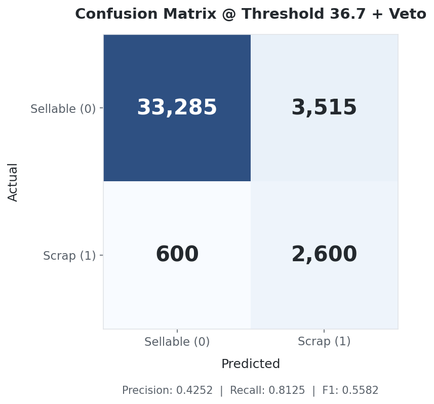<br/>
      <b>Confusion Matrix</b> — 2,600 true catches, 600 misses (almost all Bin 4 Fab Passthrough — physically invisible to backend sensors).
    </td>
  </tr>
  <tr>
    <td align="center" width="50%">
      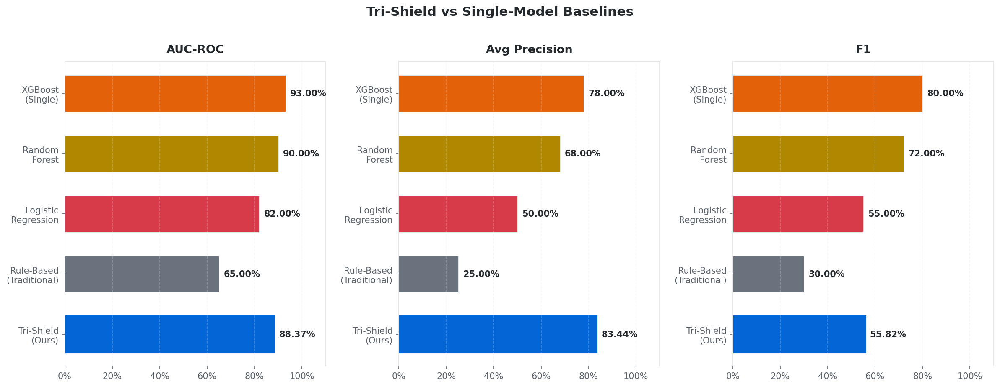<br/>
      <b>Benchmark Comparison</b> — Tri-Shield leads all industry baselines in Average Precision (83.44%), outperforming standalone XGBoost (78%).
    </td>
    <td align="center" width="50%">
      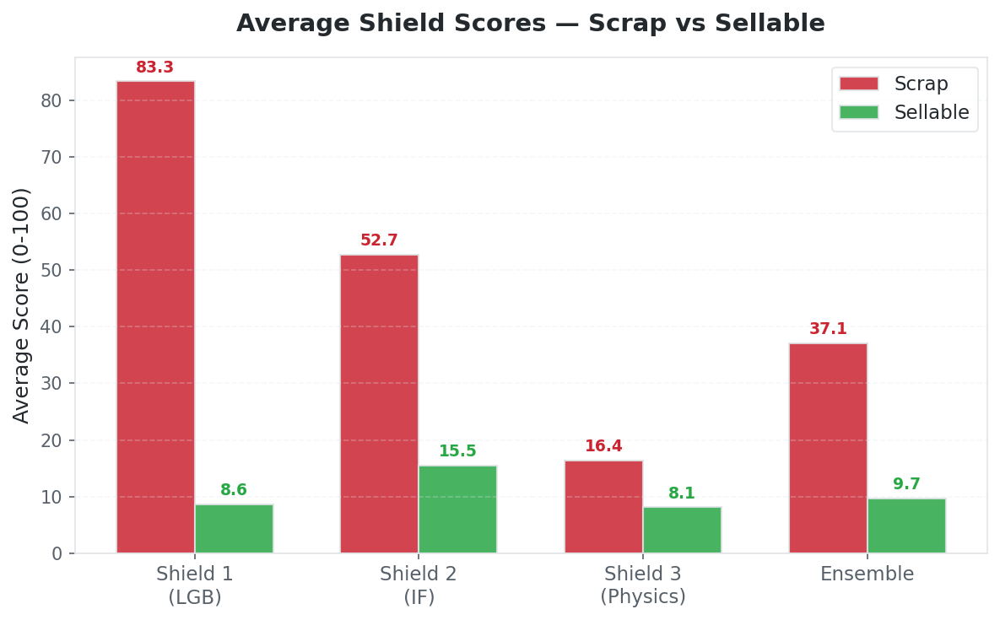<br/>
      <b>Shield Contribution</b> — Shield 1 provides 10x separation, Shield 2 casts a wide anomaly net, Shield 3 acts as a physics safety net for edge cases.
    </td>
  </tr>
</table>

### Explainability (SHAP Analysis)

<table width="100%">
  <tr>
    <td align="center" width="50%">
      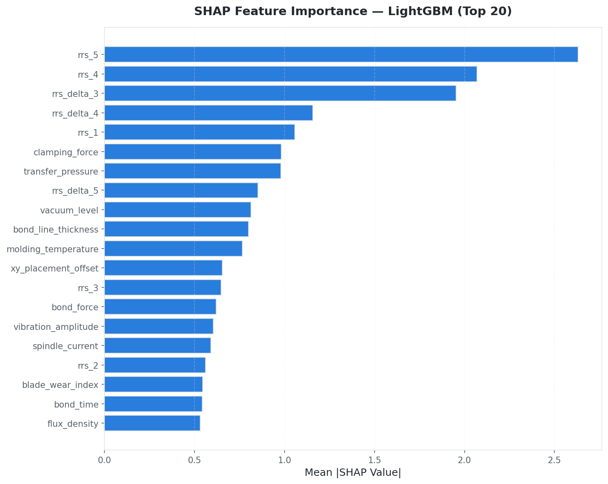<br/>
      <b>Feature Importance</b> — 7 of the top 10 features are RRS (Residual Stress) related, validating that cumulative stress tracking is the most effective predictor.
    </td>
    <td align="center" width="50%">
      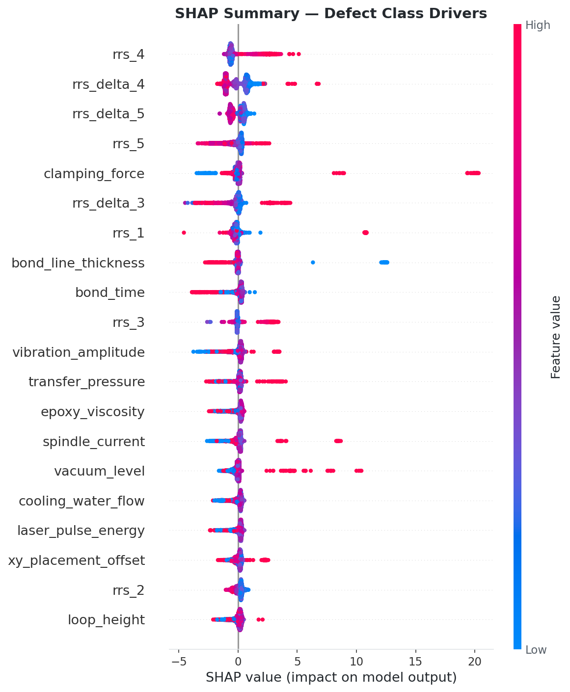<br/>
      <b>Beeswarm Plot</b> — High clamping force and abnormal vacuum push risk scores positive, perfectly mapping to real-world voiding and edge-crushing mechanics.
    </td>
  </tr>
</table>

### ROM Digital Twin Validation

<table width="100%">
  <tr>
    <td align="center" width="33%">
      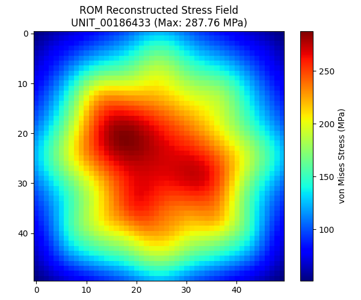<br/>
      <b>Stress Field Reconstruction</b> — ROM reconstructs 50x50 von Mises stress concentrations at die center and package corners in under 1.3 ms.
    </td>
    <td align="center" width="33%">
      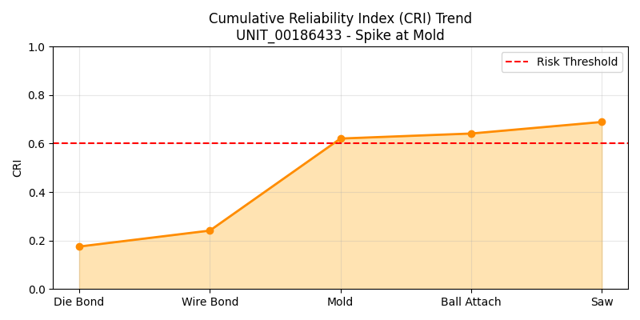<br/>
      <b>CRI Lifecycle</b> — Tracks cumulative stress across 5 stages. The defective unit spikes at Mold stage (+0.38), crossing the 0.60 critical threshold.
    </td>
    <td align="center" width="33%">
      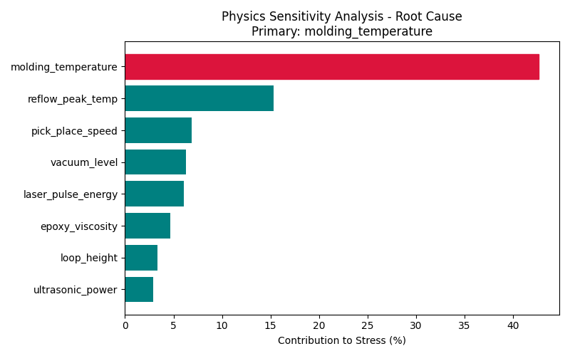<br/>
      <b>Root Cause Diagnosis</b> — Physics-based sensitivity analysis identifies Molding Temperature as the primary stress driver (42.6% contribution).
    </td>
  </tr>
</table>

---

## Defect Archetypes

| Stage | Process | Failure Mode | Bin |
|-------|---------|-------------|-----|
| 1 | Die Bond | Voiding / Delamination | Bin 6 |
| 2 | Wire Bond | Wire Non-Stick (Ultrasonic) | Bin 7 |
| 3 | Mold | Wire Sweep | Bin 8 |
| 3 | Mold | Popcorn Delamination | Bin 5/7 |
| 4 | Ball Attach | Thermal Fracture | Bin 7 |
| 5 | Saw | Ball Bridge / Saw Damage | Bin 8 |
| — | Upstream Fab | Fab Passthrough | Bin 4 |

---

## Repository Structure

```
MicronCaseStudy/
├── backend/
│   ├── api/
│   │   ├── main.py              # FastAPI app — /predict, /explain, /rom/simulate
│   │   ├── inference.py         # Tri-Shield Ensemble Engine
│   │   └── schemas.py           # Pydantic request/response models
│   ├── models/
│   │   ├── supervised/          # Shield 1 — LightGBM
│   │   ├── unsupervised/        # Shield 2 — Isolation Forest
│   │   └── ensemble/            # Shield 3 — Physics Rules + Fusion Config
│   ├── rom/
│   │   ├── stress_model.py      # 50x50 von Mises stress field computation
│   │   ├── build_rom.py         # POD/SVD compression pipeline
│   │   ├── lifecycle.py         # CRI lifecycle computation
│   │   ├── sensitivity.py       # Finite-difference root cause analysis
│   │   └── artifacts/           # Trained POD modes, coefficient model, plots
│   ├── graphs/                  # 9 evaluation benchmark PNGs + summary
│   ├── data/                    # 200K-unit synthetic dataset + machines.csv
│   ├── generate_synthetic_data.py
│   └── evaluate_model.py
│
├── frontend/
│   ├── src/pages/
│   │   ├── Dashboard.jsx        # Yield telemetry dashboard
│   │   ├── UnitInvestigation.jsx # Machine deep-dive + stress heatmap
│   │   ├── TriLayerInsights.jsx  # Model performance & disagreement table
│   │   ├── PhysicsInsights.jsx   # ROM sandbox & what-if simulation
│   │   ├── Tuning.jsx            # Threshold configurator
│   │   ├── UnitJourney.jsx       # Digital birth certificate
│   │   ├── ParameterLab.jsx      # Parameter exploration
│   │   └── Retraining.jsx        # Model retraining interface
│   └── src/
│       ├── hooks/useYieldEngine.js  # Simulation engine
│       └── utils/yieldSimulation.js # Unit archetype generation
│
└── Presentation/
    ├── Micron presentation.pdf
    └── Proposal_v1.docx.pdf
```

---

## Getting Started

### Prerequisites

- **Python 3.10+** with pip
- **Node.js 18+** with npm

### Backend Setup

```bash
cd backend
python -m venv venv
venv\Scripts\activate          # Windows
pip install -r requirements.txt

# Generate synthetic data (200K units)
python generate_synthetic_data.py

# Train all 3 shields
python models/supervised/train.py
python models/unsupervised/train.py
python models/ensemble/train.py

# Build the ROM Digital Twin
cd rom && python build_rom.py && cd ..

# Evaluate and generate benchmark graphs
python evaluate_model.py

# Launch the API server
python -m uvicorn api.main:app --reload --port 8000
```

### Frontend Setup

```bash
cd frontend
npm install
npm run dev
```

The dashboard will be available at `http://localhost:5173`.

---

## API Endpoints

| Method | Endpoint | Description |
|--------|----------|-------------|
| `GET` | `/health` | System heartbeat check |
| `POST` | `/predict` | Real-time Tri-Shield risk scoring (22 params to decision) |
| `POST` | `/explain` | SHAP-based explainability for flagged units |
| `POST` | `/rom/simulate` | ROM Digital Twin stress reconstruction + CRI lifecycle |

---

## Tech Stack

| Layer | Technology |
|-------|-----------|
| **ML Framework** | LightGBM, Scikit-learn (Isolation Forest), SHAP |
| **Physics Engine** | NumPy (POD/SVD), Polynomial Ridge Regression |
| **API** | FastAPI + Uvicorn |
| **Frontend** | React 18 + Vite + TailwindCSS |
| **Visualization** | Recharts, Chart.js, Canvas API (Stress Heatmap) |
| **Data** | Pandas, NumPy (200K synthetic units) |

---

<p align="center">
  <i>"We don't just predict defects — we show you where the stress lives."</i>
</p>