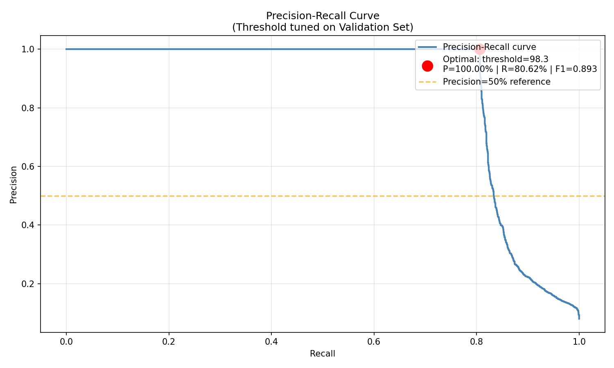
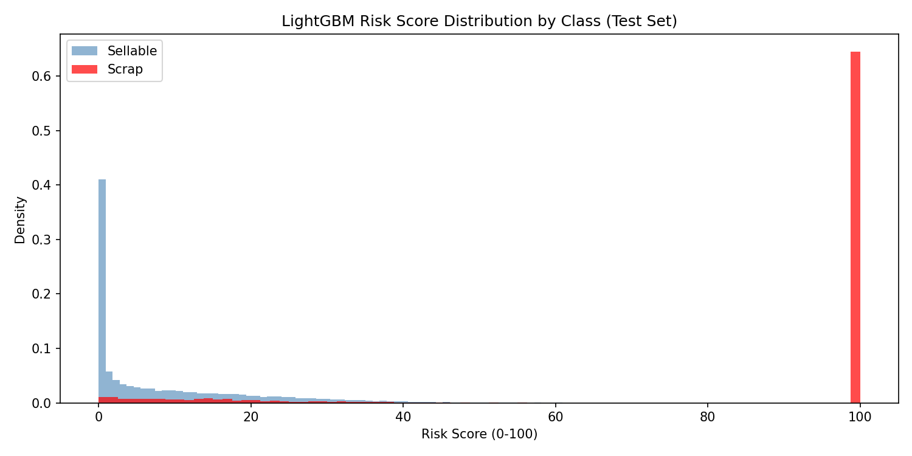
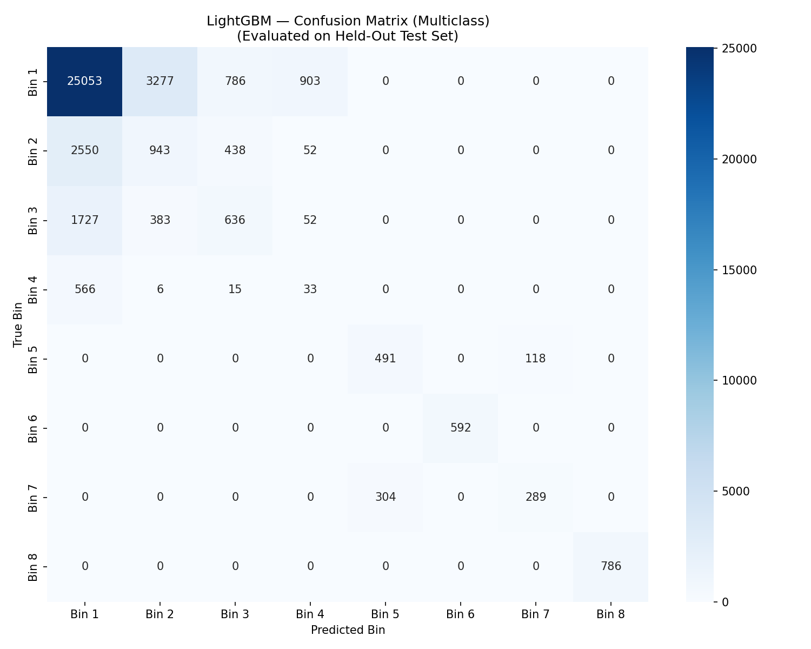
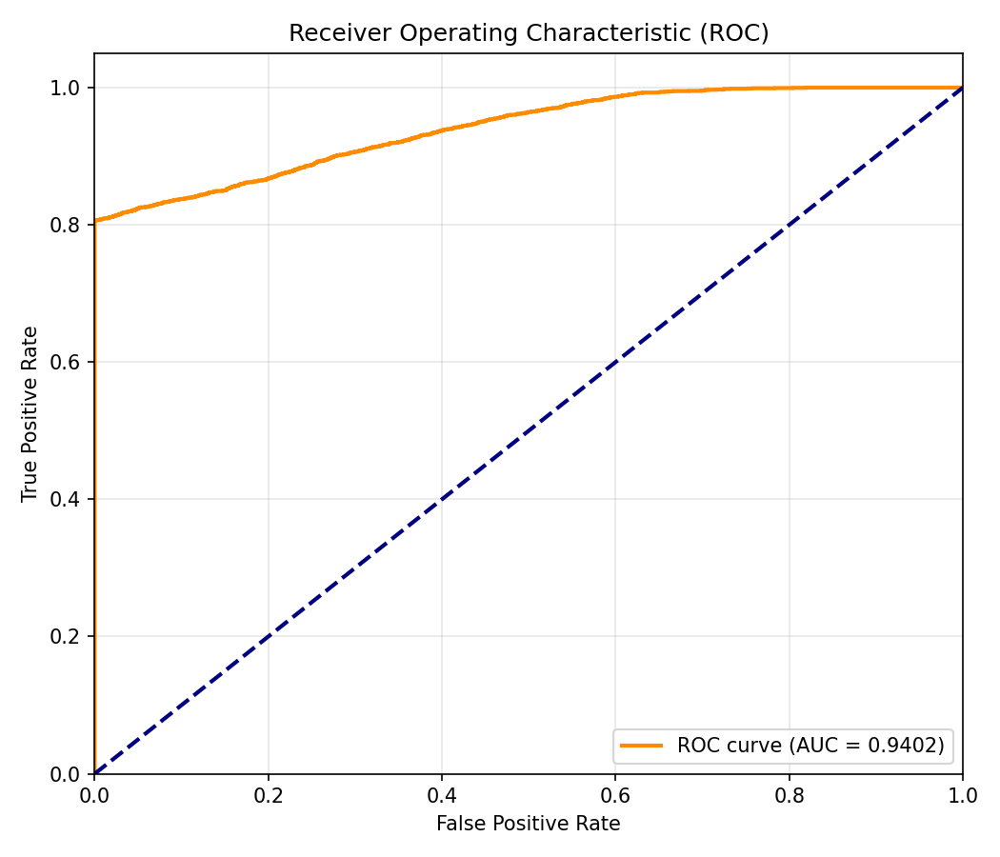
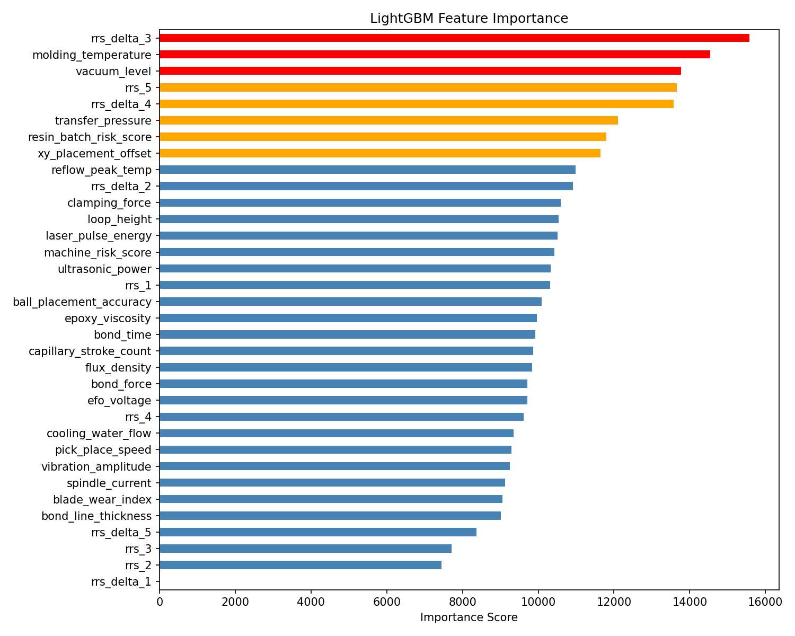

# LightGBM Supervised Model (Shield 1) Training Report
**Project Aeternum — Phase 2**

## 1. Overall Performance Summary
The LightGBM supervised model performed **exactly as intended** for a conservative, high-precision "first pass" gatekeeper. 

*   **Accuracy:** 98.45% overall (Binary: Sellable vs. Scrap)
*   **Precision (Scrap):** 100.00%
*   **Recall (Scrap):** 80.63%
*   **Optimal Risk Threshold:** 98.32 

### What this means:
Because precision is 100%, **Shield 1 has zero false alarms**. If it blocks a unit (Risk > 99.16) or flags it (Risk > 98.32), that unit is *guaranteed* to be scrap. It never accidentally throws away a healthy, sellable unit. 

However, its recall is 80.6%, meaning it **misses roughly 19.4% of the defects**. This is the exact gap that Shield 2 (Isolation Forest) is being built to catch!

---

## 2. The "Blind Spot" (Multiclass Breakdown)
When we look at the specific failure bins, we can see exactly *why* Shield 1 missed 19% of the defects:

| Defect Type | Recall (Detection Rate) | Analysis |
| :--- | :--- | :--- |
| **Bin 6** (DC Leakage) | 100% | Caught perfectly. |
| **Bin 8** (Short Circuit) | 100% | Caught perfectly. |
| **Bin 5** (High-Temp) | 80.6% | Caught the vast majority. |
| **Bin 7** (Open Circuit) | 48.7% | Struggled slightly, likely due to overlap with nominal variance. |
| **Bin 4 (Fab Passthrough)** | **5.3%** | **Completely blind.** |

**The Bin 4 Result is a Massive Success for our Architecture.** 
Bin 4 defects occur *before* the unit even reaches the packaging backend. The raw sensor readings for these units look perfectly healthy. Because LightGBM relies entirely on supervised labels and sensor thresholds, it physically cannot "see" Bin 4 failures. This proves the absolute necessity of our unsupervised anomaly detection (Shield 2), which will look for subtle, non-linear shape anomalies that the supervised model ignores.

---

## 3. Visualizations & Plot Interpretations

### A. Precision-Recall (PR) Curve

**Interpretation:** 
The PR curve stays perfectly flat at 100% precision until exactly 80.62% recall, at which point it suddenly drops vertically. This "cliff edge" shape is characteristic of a model that has found a set of rules that are 100% accurate, but can't generalize beyond them. The optimal threshold was mathematically selected exactly at the edge of this cliff (Threshold = 98.32) to capture every possible defect without sacrificing precision.

### B. Risk Score Distribution

**Interpretation:** 
The distribution shows extreme polarization, which is ideal. The blue bars (Sellable units) are heavily clustered near a risk score of 0, while the red bar (Scrap units) shoots straight up at a risk score of exactly 100. There is almost no overlap in the middle. This proves the model is highly confident in its predictions and easily separates clear defects from healthy units.

### C. Multiclass Confusion Matrix

**Interpretation:** 
The matrix provides visual proof of the "Blind Spot" mentioned above. Look at the true `Bin 4` row: the vast majority of these defects (566 out of 620) were incorrectly predicted as `Bin 1` (Healthy). Conversely, the bottom-right corner is incredibly strong — `Bin 6` and `Bin 8` have no misclassifications. The model correctly avoids false positives; there are zero instances of true `Bin 1` being predicted as anything other than `Bin 1` or `Bin 2` / `Bin 3` (which are still sellable).

### D. Receiver Operating Characteristic (ROC) Curve

**Interpretation:** 
The ROC curve achieves an excellent AUC (Area Under Curve) of 0.9402. The curve shoots up steeply on the left side, confirming that the True Positive Rate (finding defects) increases rapidly with almost zero False Positive Rate. The curve flattens out around the 80% True Positive Rate mark, aligning perfectly with the 80.6% recall limit we observed.

### E. Feature Importance

**Interpretation:** 
The model successfully prioritized physically meaningful metrics over random noise:
1. **`rrs_delta_3`** (Highest Importance, Red): This confirms that Stage 3 (Mold) is the most critical chokepoint where stress accumulates. 
2. **`molding_temperature`** & **`vacuum_level`** (Red): These are the raw features governing Stage 3. The model learned that temperature drops and poor vacuum are the root causes of popcorn delamination (Bin 5/7) and wire sweep (Bin 8).
3. **`rrs_5` & `machine_risk_score`** (Orange/Blue): The final cumulative risk score and the machine historical risk are heavily utilized, proving that the physical tolerance-stacking equation and equipment history are highly predictive features.

---

## 4. Did we use `data/machines.csv`?
We did **not** load `machines.csv` directly during training, but **yes, we used its data.** 

In FraudShieldAI, the model dynamically calculates risk scores based on historical account data. In our pipeline, the `generate_synthetic_data.py` engine already calculated the `machine_risk_score` (representing worn out or drifting machines) and embedded it directly into every row of the `synthetic_backend_assembly.csv` dataset. 

As seen in the Feature Importance plot, `machine_risk_score` ranks comfortably in the top half of features, meaning the model recognized that "which machine processed this unit" is a valid risk factor, but it correctly prioritized the actual live sensor readings (like temperature and vacuum) as the primary indicators of failure.
