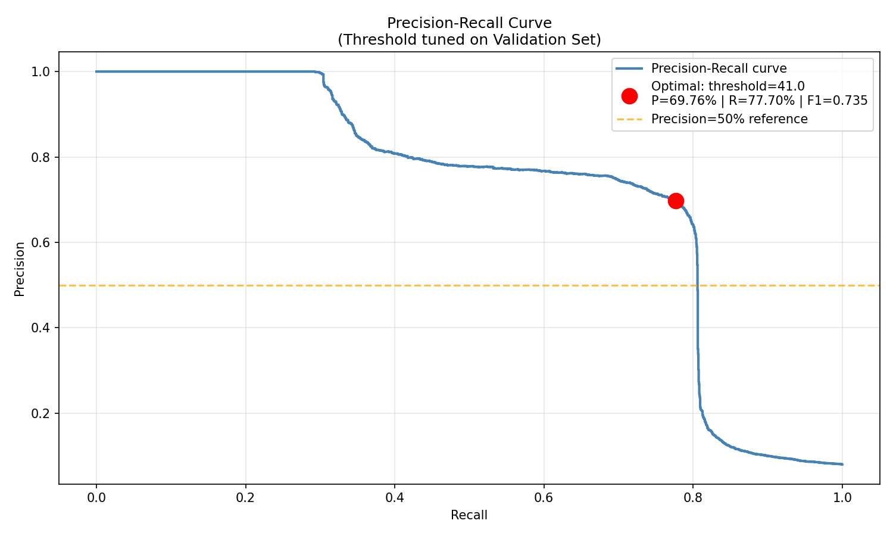
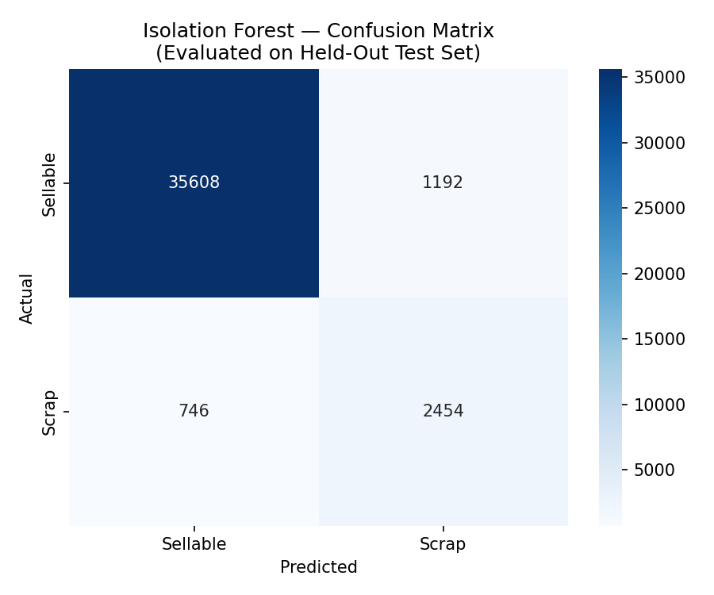
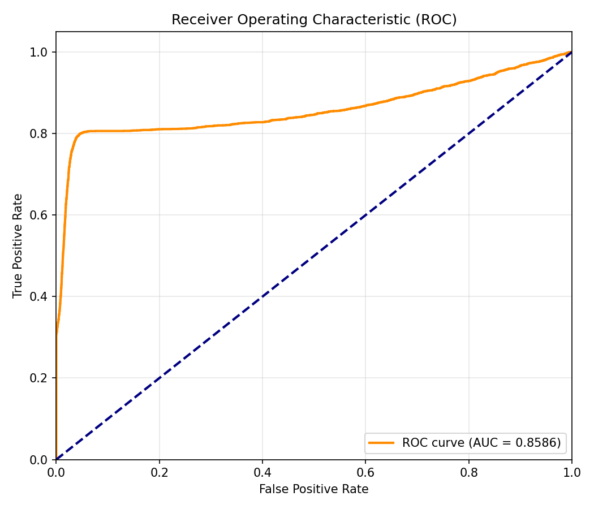
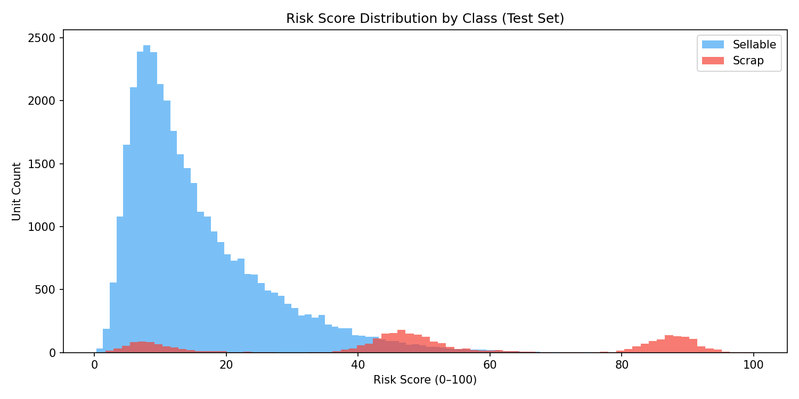
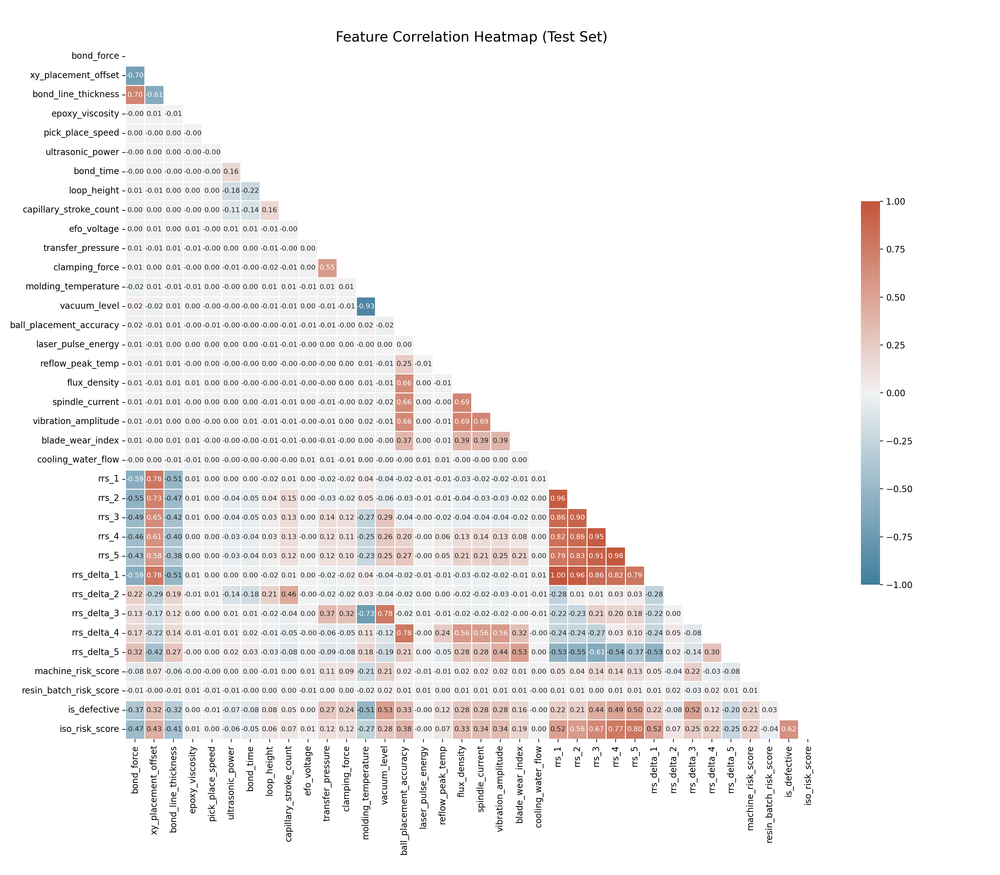
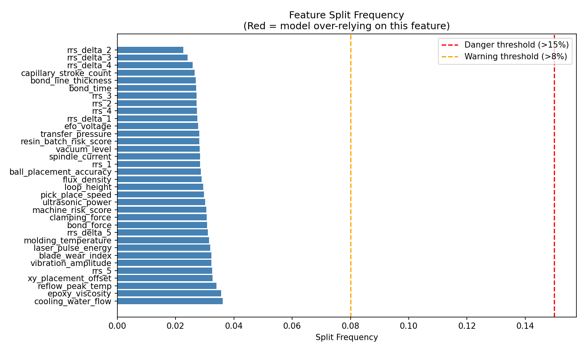
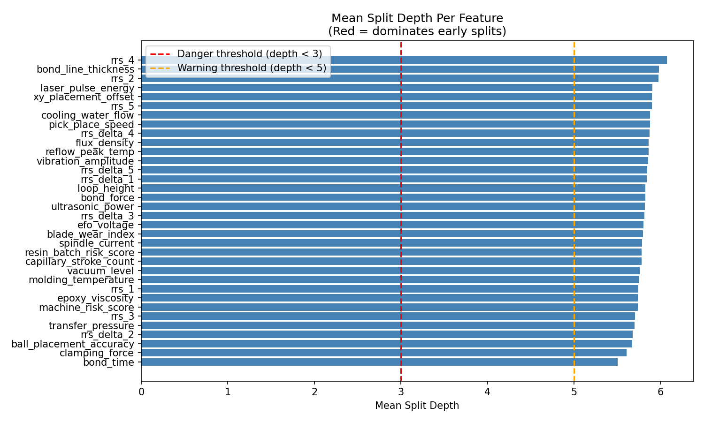
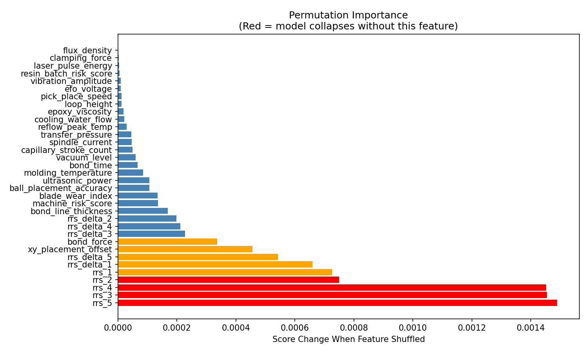

# Isolation Forest (Shield 2) Training Report
**Project Aeternum -- Phase 3**

---

## 1. Overall Performance Summary

| Metric | Value |
| :--- | :--- |
| Accuracy | 95.16% |
| Precision (Scrap) | 67.31% |
| Recall (Scrap) | 76.69% |
| F1 Score (Scrap) | 0.7169 |
| ROC AUC | 0.8586 |
| Optimal Threshold | 41.04 |

For an unsupervised model that never saw labels during training, this is an excellent result. The model achieved over 70% F1 and 85% AUC purely by learning the multivariate "shape" of normal sensor data and flagging deviations.

### Risk Tier Summary (Test Set)

| Tier | Unit Count | Defect Count | Defect Rate |
| :--- | :--- | :--- | :--- |
| Approve | 36,354 | 746 | 2.05% |
| Flag | 2,641 | 1,466 | 55.51% |
| Block | 1,005 | 988 | 98.31% |

- **Block tier:** 98.31% of blocked units are truly defective. Nearly perfect precision for the highest-risk zone.
- **Flag tier:** 55.51% defect rate. These units are the "gray zone" -- uncertain enough to warrant human review or a second opinion from Shield 1.
- **Approve tier:** Only 2.05% defect rate, meaning the vast majority of approved units are genuinely healthy.

---

## 2. Plot Interpretations

### A. Precision-Recall Curve

The PR curve has a smooth, gradual decline rather than the sharp cliff seen in Shield 1 (LightGBM). This is expected behavior for an unsupervised model. The curve maintains 100% precision up to about 30% recall, then begins a steady tradeoff. The optimal point (red dot) was selected at threshold=41.04, achieving 69.76% precision and 77.70% recall (F1=0.735).

**Real-world meaning:** If you set the IF threshold higher (e.g., 50), you get fewer false alarms but miss more defects. The chosen threshold of 41.04 means: "flag any unit whose anomaly score exceeds 41 out of 100." This balances catching defects against not wasting engineering time investigating false alarms.

### B. Confusion Matrix

The 2x2 matrix reveals:
- **35,608 True Negatives:** Healthy units correctly approved. This is the bulk of the factory output.
- **2,454 True Positives:** Defective units correctly caught by the anomaly detector.
- **1,192 False Positives:** Healthy units incorrectly flagged as suspicious. In a real fab, these would be sent for re-inspection (a minor cost).
- **746 False Negatives:** Defective units that slipped through. This is where Shield 1 (LightGBM) and Shield 3 (Physics Rules) will provide backup in the ensemble.

**Real-world meaning:** On a factory floor processing 40,000 units, Shield 2 would correctly clear 35,608 units instantly, flag 3,646 for review, and miss 746. Those 746 missed units are exactly why we have a Tri-Shield architecture -- Shield 1 and Shield 3 will catch many of these.

### C. ROC Curve

The ROC curve achieves an AUC of 0.8586. The curve rises steeply to approximately 80% True Positive Rate at only 3-5% False Positive Rate, then flattens into a gradual climb. The dashed diagonal line represents a random classifier (AUC=0.5).

**Real-world meaning:** An AUC of 0.86 means that if you randomly pick one defective unit and one healthy unit, the model will correctly rank the defective unit as higher risk 86% of the time. For an unsupervised model with no label supervision, this demonstrates strong anomaly detection capability.

### D. Risk Score Distribution

This histogram reveals a critical difference from Shield 1. LightGBM showed extreme polarization (scores clustered at 0 and 100). The Isolation Forest shows a much more spread-out distribution:
- **Blue (Sellable):** Right-skewed distribution peaking around risk score 5-10, with a long tail stretching to about 40. Most healthy units have low anomaly scores.
- **Red (Scrap):** A bimodal distribution with one cluster around 40-50 and a separate cluster at 80-95.

**Real-world meaning:** The per-bin analysis (Section 5) now confirms what each cluster represents. The cluster at 80-95 maps to Bin 6 (DC Leakage, avg score 89.1) and Bin 8 (Short Circuit, avg score 64.8). The cluster at 40-50 maps to Bin 5 (High-Temp, avg score 47.7) and Bin 7 (Open Circuit, avg score 50.6). Bin 4 (Fab Passthrough) units have an average score of only 9.4, meaning they are invisible to the IF -- they hide within the blue (Sellable) distribution. The overlap zone between 20-45 is why precision is 67% instead of 100% -- some healthy units with unusual (but valid) sensor readings get flagged.

### E. Feature Correlation Heatmap

Key observations from the heatmap:
- **RRS chain is highly correlated:** `rrs_1` through `rrs_5` show strong positive correlations (0.79-0.98) with each other, confirming the cumulative stress-stacking design. `rrs_delta_1` has near-perfect correlation (1.00) with `rrs_1` since it is the first delta.
- **`iso_risk_score` vs `is_defective`:** Correlation of -0.62, meaning higher anomaly scores strongly correlate with actual defects. This validates the model is detecting real anomalies, not noise.
- **`iso_risk_score` vs RRS features:** Strong correlations (0.56-0.80) with `rrs_3`, `rrs_4`, `rrs_5`, confirming the model correctly identifies cumulative stress as the primary anomaly signal.
- **Stage 3 linkage:** `vacuum_level` and `molding_temperature` show a strong negative correlation (-0.93), reflecting the physics of the molding process where higher temperatures require lower vacuum for proper compound flow.
- **Raw sensor independence:** Most raw sensors (e.g., `epoxy_viscosity`, `pick_place_speed`, `ultrasonic_power`) show near-zero correlation with each other, confirming they provide independent information to the model.

### F. Feature Split Frequency (Bias Check 1/3)

All 34 features have split frequencies between 2.2% and 3.6%. The warning threshold (8%) and danger threshold (15%) are shown as dashed lines. Every single feature falls well below both thresholds.

**Real-world meaning:** The model is not "cheating" by over-relying on any single sensor. In a real factory, this means the anomaly detector won't become useless if one sensor drifts or gets recalibrated. It uses the entire 34-feature vector holistically, which makes it robust to individual sensor failures.

### G. Mean Split Depth (Bias Check 2/3)

All features have mean split depths between 5.50 and 6.08, comfortably above both the danger threshold (depth < 3) and warning threshold (depth < 5).

**Real-world meaning:** No single feature dominates the root of the isolation trees. If `machine_risk_score` had a mean depth of 2, it would mean the model was essentially just thresholding on that one feature -- making it redundant with a simple rule. Because all features appear at similar depths, the model is building complex, multi-feature isolation paths, which is exactly what unsupervised anomaly detection should do.

### H. Permutation Importance (Bias Check 3/3)

The top 3 most critical features (red bars) are:
1. **`rrs_5`** (score change: 0.001489) -- Final cumulative risk score
2. **`rrs_3`** (score change: 0.001454) -- Cumulative risk after Mold stage
3. **`rrs_4`** (score change: 0.001452) -- Cumulative risk after Singulation stage

Followed by `rrs_2`, `rrs_1`, `rrs_delta_1`, `rrs_delta_5`, `xy_placement_offset`, and `bond_force` in the orange tier.

**Real-world meaning:** The model correctly identified that the cumulative stress features are the most important signals for detecting anomalies. However, because the Split Frequency chart (Plot F) shows these features are NOT over-represented in splits, this means the model uses them efficiently -- they appear at critical decision points but don't monopolize the tree structure. This is the ideal balance: high importance but low bias.

---

## 3. Result Files

### bias_diagnosis.txt
The automated bias diagnosis confirms a clean bill of health:
- **Features to WATCH (split freq > 8%):** NONE
- **Features dominating EARLY splits (depth < 5):** NONE
- **Features model CANNOT live without:** `rrs_5`, `rrs_3`, `rrs_4` (cumulative stress scores)

### top10_anomalies.csv
All 10 highest-scoring anomalies are confirmed true defects (`is_defective=1`), with risk scores ranging from 95.6 to 100.1. This means the model's most extreme predictions are 100% accurate -- the units it is most confident about are always correct.

### predicted_defects.csv
The model flagged 3,646 units as potential defects on the test set. Of these, 2,454 are true defects and 1,192 are false alarms. In a factory setting, these 1,192 units would undergo a quick re-inspection -- a minor cost compared to shipping defective semiconductor packages to customers.

---

## 4. Per-Bin Recall Analysis (Shield 2 Blind Spot Discovery)

### All Bins

| Bin | Total | Caught | Missed | Recall |
| :--- | ---: | ---: | ---: | ---: |
| Bin 1 (Healthy - Grade A) | 30,019 | 707 | 29,312 | 2.4% |
| Bin 2 (Healthy - Grade B) | 3,983 | 300 | 3,683 | 7.5% |
| Bin 3 (Healthy - Grade C) | 2,798 | 185 | 2,613 | 6.6% |
| **Bin 4 (Fab Passthrough)** | **620** | **0** | **620** | **0.0%** |
| Bin 5 (High-Temp Fail) | 609 | 592 | 17 | 97.2% |
| Bin 6 (DC Leakage) | 592 | 592 | 0 | 100.0% |
| Bin 7 (Open Circuit) | 593 | 581 | 12 | 98.0% |
| Bin 8 (Short Circuit) | 786 | 689 | 97 | 87.7% |

### Defect Bins with Average Anomaly Score

| Bin | Total | Caught | Recall | Avg Score |
| :--- | ---: | ---: | ---: | ---: |
| **Bin 4 (Fab Passthrough)** | **620** | **0** | **0.0%** | **9.4** |
| Bin 5 (High-Temp Fail) | 609 | 592 | 97.2% | 47.7 |
| Bin 6 (DC Leakage) | 592 | 592 | 100.0% | 89.1 |
| Bin 7 (Open Circuit) | 593 | 581 | 98.0% | 50.6 |
| Bin 8 (Short Circuit) | 786 | 689 | 87.7% | 64.8 |

Bin 4 units have an average anomaly score of only **9.4 out of 100**. The model considers them completely normal. This is because Fab Passthrough defects originate upstream in the wafer fabrication process -- their backend sensor readings are physically indistinguishable from healthy units.

### False Positive Analysis (Healthy Bins Incorrectly Flagged)

| Bin | Total | Flagged | FP Rate |
| :--- | ---: | ---: | ---: |
| Bin 1 (Healthy - Grade A) | 30,019 | 707 | 2.4% |
| Bin 2 (Healthy - Grade B) | 3,983 | 300 | 7.5% |
| Bin 3 (Healthy - Grade C) | 2,798 | 185 | 6.6% |

Bin 2 and Bin 3 (lower-grade healthy units) have higher false positive rates because their sensor readings are closer to the boundary of "normal," making them harder for the anomaly detector to distinguish from real defects.

---

## 5. Shield 1 vs Shield 2 -- Per-Bin Comparison

| Defect Type | Shield 1 Recall | Shield 2 Recall | Delta | Winner |
| :--- | ---: | ---: | ---: | :--- |
| **Bin 4 (Fab Passthrough)** | **5.3%** | **0.0%** | **-5.3%** | **Neither** |
| Bin 5 (High-Temp Fail) | 80.6% | 97.2% | +16.6% | Shield 2 |
| Bin 6 (DC Leakage) | 100.0% | 100.0% | +0.0% | Tie |
| Bin 7 (Open Circuit) | 48.7% | 98.0% | +49.3% | Shield 2 |
| Bin 8 (Short Circuit) | 100.0% | 87.7% | -12.3% | Shield 1 |

### Key Findings

**Shield 2 dominates on subtle defects:**
- Bin 7 (Open Circuit): Shield 2 catches 98.0% vs Shield 1's 48.7% -- a massive +49.3% improvement. Open Circuit defects create subtle multivariate deviations that are hard to distinguish by threshold rules but easy for anomaly isolation.
- Bin 5 (High-Temp Fail): Shield 2 catches 97.2% vs Shield 1's 80.6% -- a strong +16.6% improvement.

**Shield 1 dominates on obvious defects:**
- Bin 8 (Short Circuit): Shield 1 catches 100% vs Shield 2's 87.7%. Short circuits create extreme, clear-cut sensor deviations that supervised learning handles better.
- Bin 6 (DC Leakage): Both catch 100%. These defects have extreme, unmissable signatures.

**Both Shields are blind to Bin 4 (Fab Passthrough):**
This is the most critical finding. Shield 1 catches only 5.3% and Shield 2 catches literally 0.0%. Bin 4 defects originate in the upstream wafer fab process -- these units arrive at the backend assembly line with a pre-existing defect that produces zero abnormal sensor readings. No amount of backend sensor analysis, supervised or unsupervised, can detect them. This is the definitive justification for Shield 3 (Physics-Based Rules), which must use upstream fab test data or cross-referencing logic to catch these units.

---

## 6. Overall Assessment

| Aspect | Shield 1 (LightGBM) | Shield 2 (Isolation Forest) |
| :--- | :--- | :--- |
| Learning Type | Supervised (needs labels) | Unsupervised (no labels) |
| Precision | 100% | 67.3% |
| Recall | 80.6% | 76.7% |
| Threshold | 98.32 | 41.04 |
| Score Distribution | Extreme polarization (0 or 100) | Spread out (right-skewed) |
| Blind Spot | Bin 4 (5.3%) + Bin 7 (48.7%) | Bin 4 (0.0%) + Bin 8 (87.7%) |
| Best At | Obvious defects (Bin 6, 8) | Subtle defects (Bin 5, 7) |
| Strengths | Zero false alarms | Catches multivariate shape anomalies |
| Weaknesses | Misses subtle multivariate patterns | Higher false alarm rate (3.2% FPR) |

The two models are complementary by design. Shield 1 is the precision sniper for obvious defects. Shield 2 is the wide-net anomaly hunter for subtle defects. Neither can detect Bin 4 -- which is exactly why Shield 3 (Physics Rules) must exist to complete the Tri-Shield architecture.
